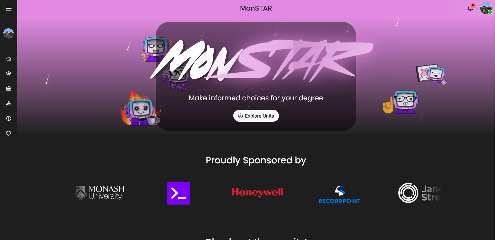
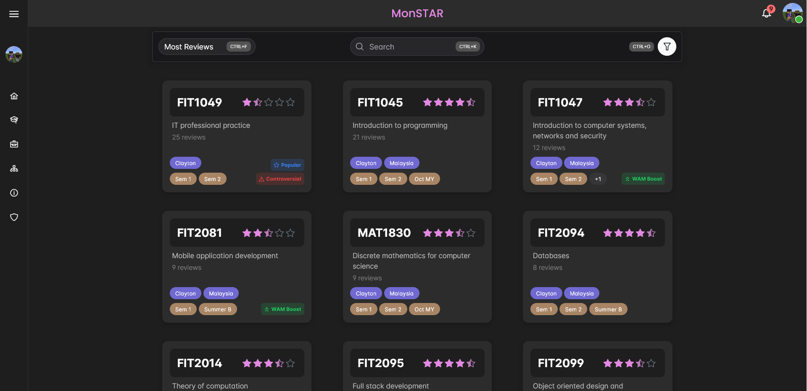
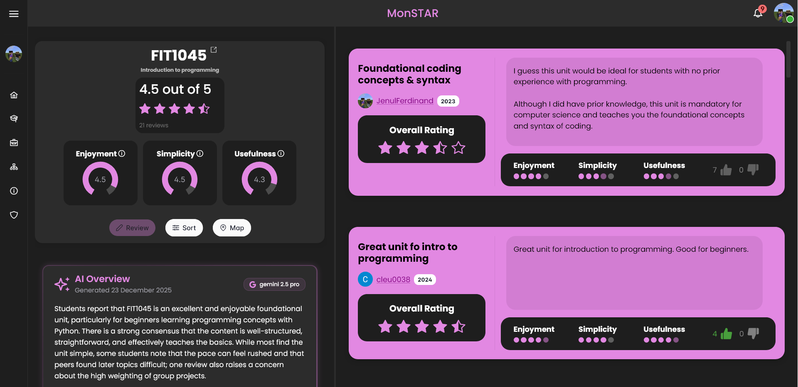
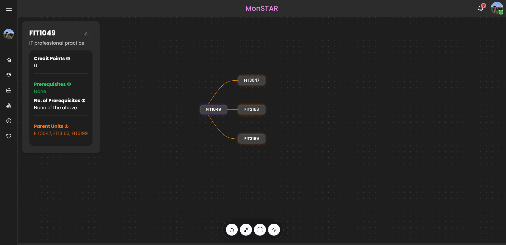

  

  <i>A digital platform built for students at Monash University. Real unit reviews from students.</i>

<h3 align="center">
  <a href="https://monstar.wired.org.au">Website</a>
   · 
  <a href="./CONTRIBUTING.md">Contributing</a>
   · 
  <a href="https://github.com/wiredmonash/monstar/issues">Issues</a>
   · 
  <a href="https://monstar.wired.org.au/changelog">Changelog</a>
</h3>

 

## What is MonSTAR?

MonSTAR helps Monash University students make informed decisions about their unit selections. The platform aggregates student reviews and SETU (Student Evaluation of Teaching and Units) data from 2019 onwards, providing both qualitative experiences and quantitative metrics for thousands of units.

Students can browse units, read peer reviews, compare SETU scores across semesters, and contribute their own experiences after completing units.

## Features

MonSTAR provides several features for exploring and reviewing Monash subjects:

- **Unit Search** - Search by unit code or name, with filters for teaching period, faculty, and more
- **Student Reviews** - Read and write reviews with ratings across enjoyment, simplicity, and usefulness
- **AI Sentiment Overviews** - Gemini summaries of sentiment across a unit's student reviews
- **SETU Data** - Historical SETU results from semester 1 2019 to the latest (authentication required)
- **Unit Pathways Map** - Interactive graph of unit pathways, prerequisites, and follow-on requirements
- **Google Authentication** - Monash student and staff verification by email
- **Review Interactions** - Like/dislike reviews with notifications
- **Unit Tags** - Dynamically assigned tags like "WAM Booster"

## Screenshots

<table>
  <tr>
    <td width="50%"> <b>Home</b> - explore units and see what's trending</td>
    <td width="50%"> <b>Browse</b> - search and filter by rating, campus, and teaching period</td>
  </tr>
  <tr>
    <td width="50%"> <b>Unit page</b> - ratings, reviews, and a Gemini sentiment overview</td>
    <td width="50%"> <b>Pathways</b> - prerequisites and follow-on units as an interactive graph</td>
  </tr>
</table>

## Architecture
### System context

### Container diagram

## Contributing

MonSTAR was built by Monash students. Contributions are welcome from the community.

Before starting work on a feature, please read the [Contributing Guide](./CONTRIBUTING.md) for:
- Development environment setup
- Code style and conventions
- Pull request process
- Testing requirements

You can contribute by:
- Reporting bugs or suggesting features via [GitHub Issues](https://github.com/wiredmonash/monstar/issues)
- Fixing existing issues
- Improving documentation
- Adding new features (after discussing in an issue first)

## Contributors

## Data Sources

MonSTAR's unit catalog and SETU data are sourced using tools developed by **Sai Kumar Murali Krishnan**:
- [monash-handbook-scraper](https://github.com/saikumarmk/monash-handbook-scraper) - Unit metadata extraction
- [unit-outcome-miner](https://github.com/saikumarmk/unit-outcome-miner) - SETU survey data aggregation

## Contact

**Developed by:** WIRED Projects Team, Monash University \
**Primary person of contact:** [@jenul-ferdinand](https://github.com/jenul-ferdinand) on GitHub or proxy_dev on Discord\
**Issues:** [GitHub Issues](https://github.com/wiredmonash/monstar/issues)

## License

This project is licensed under the AGPL 3.0 License - see the [LICENSE](LICENSE) file for details.
